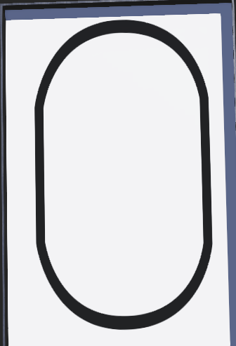

# proyecto_robotica

Para este proyecto se tuvo que realizar un codigo para que un robot entregado por el profesor pudiera hacer un recorrido.

El robot constó de un sensor como se muestra en la imagen N°1, donde la regleta constaba de 8 sensores, los cuales se utilizaron 6, para ello se hicieron 3 promedios, el primero con los dos sesores de la izquierda, el segundo promedio con los sensores de al medio y el tercero promedio con los dos sensores de la derecha, al sobrar dos sensores, se descartaron los extremos.

Imagen N°1 (referencia del sensor)

Además, el robot constaba con dos motores, lo cual hizo que el robot fuera diferencial, y tambien se utilizó un H-bridge, para poder controlar las direcciones de las ruedas y la potencia que se les dio para cada situación. 

El problema se resolvió primero calibrando los sensores, de esta manera el robot toma los valores de los sensores cuando esta en el cmaino y cuando no lo esta, y con esos valores crea un nuevo rango calibrado, donde la diferencia del valor que entrega los sensores cuando esta en el camino y cuando no lo está es más amplio, por lo que es mas facil de trabajar y hay mas margen de error, además se creo una maquina de estados, las cuales tiene avanzar, girar a la derecha, girar a la izquierda y stop, una vez calibrado el robot avanza y cambia de estado dependieno de los valores del promedio de los sensores, si el promedio del sensor de la izquierda es menor a 500 (blanco) y los otros dos promedios son sobre 500 (negro), entonces el robot gira a la derecha, lo mismo pasa si es que el promedio de la derecha es bajo 500 (blanco) y los otros dos promomedios sobre 500 (negro), entonces girara a la izquierda, en el caso que los tres promedios sean bajo 500 (blanco) el robot se detendrá, y en cualquier otro caso el robot avanzará.

Imagen N°2 (referencia del recorrido)
